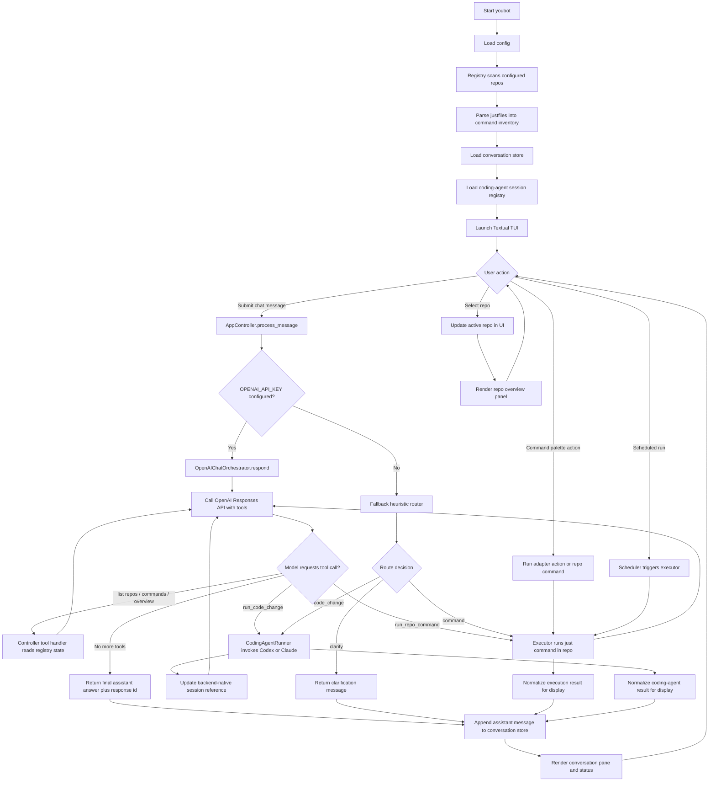
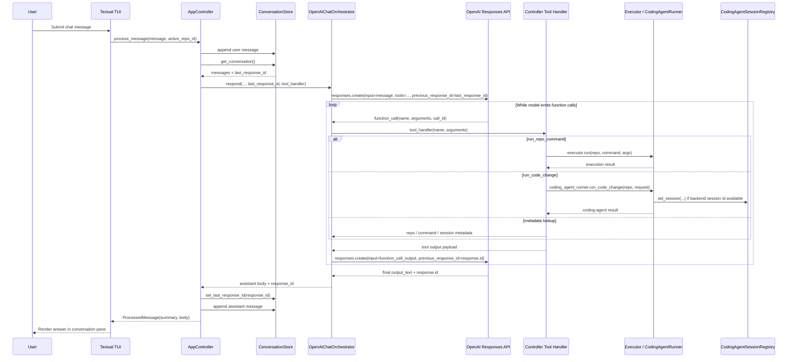

# Youbot Architecture

## Purpose

This document translates the product requirements in `docs/PRD.md` into a concrete system design. It is intended to constrain implementation choices so a coding agent can build the system in bounded slices without re-deciding the architecture.

## System boundaries

Youbot is a local Python application with a Textual TUI. It orchestrates a set of registered repos by:

- Discovering and parsing each repo's `justfile`
- Persisting repo metadata, lightweight conversation history, and coding-agent session references in youbot-owned storage
- Routing natural-language requests to the correct repo and execution mode
- Driving primary chat orchestration through the OpenAI Responses API with tool calls
- Running `just` commands in repo directories
- Invoking a configurable coding-agent backend for code-change requests when no existing command fits
- Rendering repo-specific views through youbot-owned adapters

Integrated repos are treated as capability providers. They are not required to embed UI code or conform to youbot's internal architecture.

The system is repo-first in v1, but this module structure should not assume that every future integration type is necessarily a local repo. Where practical, interfaces should avoid unnecessary coupling to repo-only concepts.

## Core modules

The initial implementation should be organized around these modules:

### `registry`

Responsibilities:
- Load configured repos from youbot config
- Validate that a repo has a usable `justfile`
- Store and retrieve repo metadata
- Persist discovered commands, tags, summaries, routing hints, and repo classification

Key rule:
- The registry is the source of truth for repo metadata inside youbot.

### `conversation_store`

Responsibilities:
- Persist youbot's own conversation history
- Provide conversation history to the router

Key rule:
- This store is for youbot conversation state, not for reconstructing coding-agent sessions.

### `coding_agent_sessions`

Responsibilities:
- Persist backend-native coding-agent session references by repo
- Store backend name, session kind, session id, and human-readable purpose/summary
- Allow the coding-agent runner to resume an existing backend-native non-interactive session when appropriate

Key rule:
- Youbot stores session references, not full reconstructed coding-agent transcripts.

### `justfile_parser`

Responsibilities:
- Discover available `just` recipes
- Extract recipe names and, where possible, descriptions or inline comments
- Normalize command metadata into a canonical internal representation

Key rule:
- Parser output feeds both routing and command-palette generation.

### `openai_chat`

Responsibilities:
- Assemble model instructions from user message, conversation context, repo metadata, and discovered commands
- Expose explicit tools for listing repos, listing commands, running repo commands, and triggering code-change work
- Continue provider-native conversation state through the provider response id
- Return concise user-facing answers rather than raw backend transcripts

Key rule:
- The primary conversational path is tool-driven, not prompt-only string routing.

### `router`

Responsibilities:
- Provide a simple local fallback decision path when OpenAI-backed orchestration is unavailable
- Map obvious prompts to repo/action/command selections without external API calls

Key rule:
- The heuristic router is fallback behavior, not the primary orchestration design.

### `executor`

Responsibilities:
- Run `just <recipe>` in the selected repo
- Capture stdout, stderr, exit status, duration, and parsed structured output
- Return normalized execution results for UI rendering and session logging

Key rule:
- Command execution is the default path when a matching capability exists.

### `coding_agent_runner`

Responsibilities:
- Invoke the configured coding-agent backend in the target repo for code-change requests
- Provide request context and capture subprocess outcome
- Use backend-native continuation when a stored non-interactive session reference is available
- Record the result in conversation state and registry hints
- Support backend switching between at least Claude Code and Codex without changing callers

Key rule:
- This path is only used when no suitable `just` command exists or when the router explicitly chooses code change.
- The runner should use non-interactive backend entrypoints only. Interactive pickers and interactive terminal resume flows are out of scope for v1 orchestration.

### `adapters`

Responsibilities:
- Load youbot-owned repo adapters from local state
- Provide repo-specific command palette entries
- Map command output into Textual views
- Generate adapter metadata during repo onboarding and refresh
- Store selected overview sections, fallback commands, and preferred render modes in adapter metadata
- Hold parsing and presentation hints

Key rule:
- Adapters belong to youbot, not to the child repos.

### `scheduler`

Responsibilities:
- Execute configured recurring `just` commands
- Log results to youbot state
- Surface recent scheduled activity in the UI

Key rule:
- Scheduling configuration lives in youbot, never in child repos.

### `tui`

Responsibilities:
- Render the conversation pane
- Render repo list/status sidebar
- Render a selected-repo overview workspace with a preview of current repo data
- Manage repo focus and screen switching
- Expose global and repo-scoped command palette actions
- Display execution results and structured views

Key rule:
- The TUI is a consumer of registry, conversation state, routing, and adapters. It should not own business logic.

## Persistence model

Youbot owns its application state. Child repos remain external systems.

Expected state areas:

- Config:
  - registered repos
  - scheduler configuration
  - user preferences
  - coding-agent backend selection
  - backend-specific invocation settings
- Registry store:
  - repo records
  - discovered commands
  - routing hints
  - adapter metadata
- Conversation store:
  - youbot conversation history
- Coding-agent session registry:
  - repo id to backend-specific session reference
  - last used backend
  - session kind
  - short session purpose/status
- Adapter store:
  - local adapter code or adapter definitions
  - parser hints
  - view configuration
- Execution history:
  - recent commands
  - exit status
  - timestamps

The exact on-disk format can be JSON or SQLite in the first version. The implementation should pick one format and use it consistently.

## Main runtime flows

## Overall control flow



## OpenAI chat sequence



### 1. Repo onboarding

1. User adds a repo path.
2. Controller normalizes repo id, name, and classification for registration.
3. Config is updated so the repo is part of the persistent configured set.
4. Registry validates presence of `justfile`.
5. `justfile_parser` discovers commands.
6. Registry stores repo metadata and initial command inventory.
7. Adapter loader generates or refreshes local adapter metadata and generated adapter artifacts.
8. Adapter metadata captures the initial overview sections and rendering hints.
9. Repo becomes available in the TUI and CLI without manual config editing.

### 2. Startup and restore state

1. Youbot starts.
2. Registry loads registered repos.
3. Conversation store loads recent youbot conversation history.
4. Coding-agent session registry loads repo-specific backend-native session references.
5. TUI opens in the global chat view with no repo selected by default.

Switching into a repo restores repo focus, command palette context, adapter state, and any available coding-agent continuation metadata. It does not require a separate repo-scoped youbot transcript.

### 3. Natural-language request

1. User submits a message.
2. TUI sends the message plus active scope to `openai_chat`.
3. `openai_chat` calls the OpenAI Responses API with conversation context and tool definitions.
4. The model issues tool calls to inspect repo state or execute actions.
5. Tool handlers call executor or coding-agent runner as needed.
6. `openai_chat` returns the final user-facing answer and provider response id.
7. Result is rendered in the TUI, appended to youbot conversation history, and used to update any coding-agent session reference.

Fallback behavior:
- If OpenAI-backed orchestration is unavailable, the local heuristic router may still choose a repo and action for simple cases.

### 4. Command-palette action

1. User opens the command palette.
2. Global commands are always available.
3. If a repo is focused, the active adapter contributes repo-specific commands.
4. Selected command invokes executor or a UI-only adapter action.

### 5. Repo selection and overview workspace

1. User selects a repo in the sidebar.
2. TUI sets active repo focus immediately and renders a loading state for the repo workspace.
3. Controller builds a repo-specific overview using adapter metadata, coding-agent session state, and the adapter's overview sections.
4. Overview section commands run in the repo and return concise summaries for the selected-repo panel, preferring structured JSON output when available.
5. The TUI updates the repo workspace while keeping the main conversation available.

## Error handling

The system should treat these as expected operational cases:

- Missing or invalid `justfile`
- Repo path no longer exists
- `just` executable missing on the host
- Recipe exits non-zero
- Command output is not parseable as structured data
- Router returns an invalid decision
- configured coding-agent backend fails or is unavailable

Initial error-handling rules:

- Show failures inline in the conversation pane
- Preserve raw stderr for inspection
- Do not destroy conversation history or coding-agent session references on failure
- Mark affected repo status in the registry

## Non-goals for v1

- Editing child-repo UI code
- Deep semantic parsing of arbitrary shell output
- Multi-user synchronization
- Remote orchestration
- Strong plugin sandboxing

## Recommended package layout

One reasonable initial package shape is:

```text
youbot/
  __init__.py
  app.py
  config.py
  registry.py
  conversation_store.py
  coding_agent_sessions.py
  justfile_parser.py
  router.py
  executor.py
  coding_agent_runner.py
  adapters/
    __init__.py
    loader.py
    models.py
  tui/
    __init__.py
    app.py
    screens.py
    widgets.py
    command_palette.py
```

This layout is not mandatory, but the separation of concerns is.
