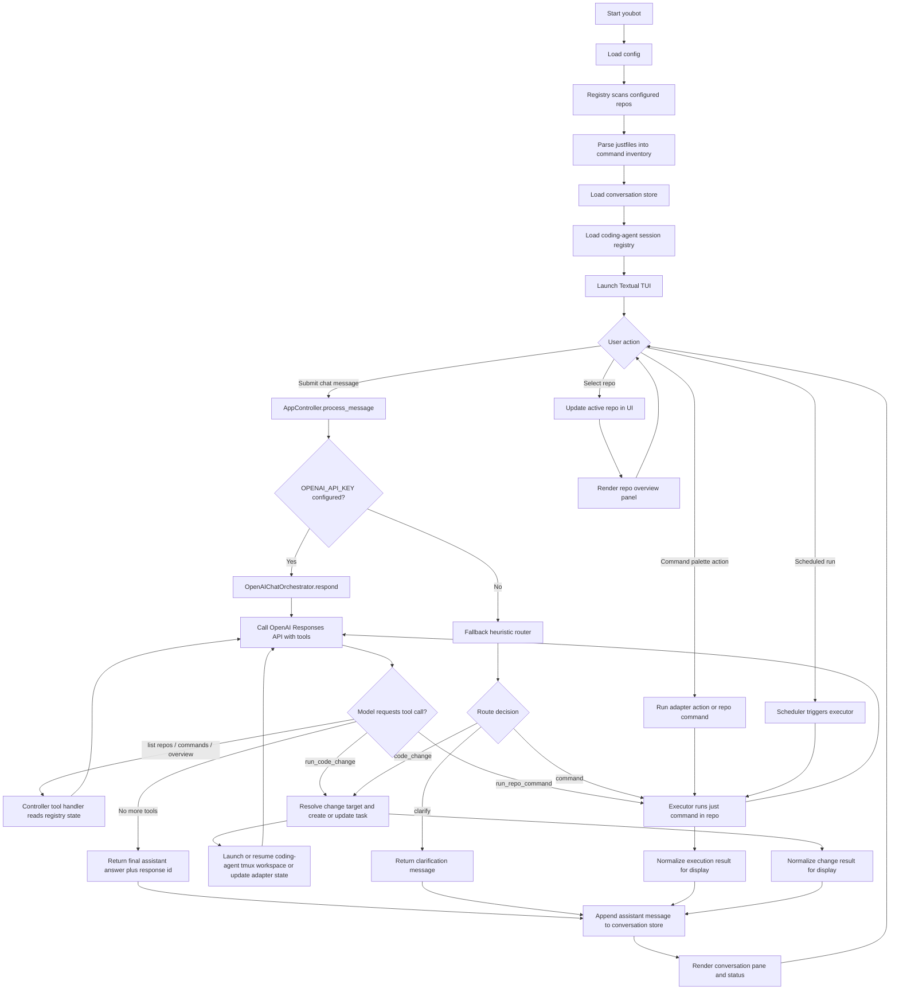
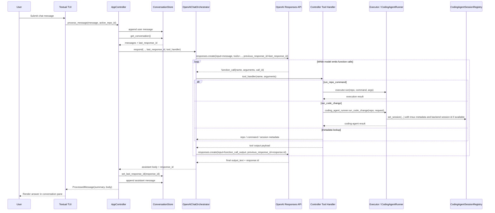

# Youbot Architecture

## Purpose

This document translates the product requirements in `docs/PRD.md` into a concrete system design. It is intended to constrain implementation choices so a coding agent can build the system in bounded slices without re-deciding the architecture.

Unless a section is explicitly labeled as an implementation profile, the contracts in this document should be readable as language-neutral system design. The current codebase is Python, but the architectural boundaries here are not meant to require Python in integrated or managed repos.

## System boundaries

Product contract:
- Youbot is a local TUI application that orchestrates a set of registered repos through command discovery, routing, execution, and code-change delegation.

Current implementation profile:
- The current implementation is a local Python application with a Textual TUI.

Core system responsibilities:

- Discovering and parsing each repo's `justfile`
- Persisting repo metadata, lightweight conversation history, task state, and coding-agent session records in youbot-owned storage
- Routing natural-language requests to the correct repo and execution mode
- Driving primary chat orchestration through the OpenAI Responses API with tool calls
- Running `just` commands in repo directories
- Invoking a configurable coding-agent backend for code-change requests when no existing command fits
- Launching and resuming coding-agent work inside managed `tmux` sessions
- Tracking explicit tasks that represent command runs, coding-agent work, and scheduled jobs
- Rendering repo-specific views through youbot-owned adapters
- Surfacing live coding-agent activity in the TUI while long-running agent work is in progress
- Surfacing a structured routing trace that explains completed routing/orchestration steps, pending decisions, and the current in-flight step for the active chat turn

Integrated repos are treated as capability providers. They are not required to embed UI code or conform to youbot's internal architecture.

The system is repo-first in v1, but this module structure should not assume that every future integration type is necessarily a local repo. Where practical, interfaces should avoid unnecessary coupling to repo-only concepts.

## Core modules

The initial implementation should be organized around these modules:

### `registry`

Responsibilities:
- Load configured repos from youbot config
- Validate that a repo has a usable `justfile`
- Store and retrieve repo metadata
- Persist discovered commands, tags, summaries, routing hints, and repo classification

Key rule:
- The registry is the source of truth for repo metadata inside youbot.

### `conversation_store`

Responsibilities:
- Persist youbot's own conversation history
- Provide conversation history to the router

Key rule:
- This store is for youbot conversation state, not for reconstructing coding-agent sessions.

### `coding_agent_sessions`

Responsibilities:
- Persist coding-agent session records by repo
- Store backend name, `tmux` session metadata, backend-native continuation handles when available, and human-readable purpose/summary
- Allow the coding-agent runner to resume an existing repo workspace session when appropriate

Key rule:
- Youbot stores session metadata and terminal attachment info, not full reconstructed coding-agent transcripts.

### `task_store`

Responsibilities:
- Persist tracked work items for commands, coding-agent sessions, adapter changes, and scheduled jobs
- Link tasks to repos, sessions, schedule runs, and recent outputs
- Provide current task state to the TUI and orchestrator

Key rule:
- Tasks are explicit orchestration records, not inferred only from chat history.

### `justfile_parser`

Responsibilities:
- Discover available `just` recipes
- Extract recipe names and, where possible, descriptions or inline comments
- Normalize command metadata into a canonical internal representation

Key rule:
- Parser output feeds both routing and command-palette generation.

### `openai_chat`

Responsibilities:
- Assemble model instructions from user message, conversation context, repo metadata, tasks, and discovered commands
- Expose explicit tools for listing repos, listing commands, creating or updating tasks, running repo commands, and triggering code-change work
- Continue provider-native conversation state through the provider response id
- Emit structured routing/orchestration trace updates as tool selection and execution progress
- Return concise user-facing answers rather than raw backend transcripts

Key rule:
- The primary conversational path is tool-driven, not prompt-only string routing.

Implementation note:
- Keep OpenAI tool schema construction in a dedicated helper module so tool definitions do not bloat the chat orchestration class.

### `router`

Responsibilities:
- Provide a simple local fallback decision path when OpenAI-backed orchestration is unavailable
- Map obvious prompts to repo/action/command selections without external API calls
- Emit the same structured routing trace shape used by the primary chat path

Key rule:
- The heuristic router is fallback behavior, not the primary orchestration design.

Implementation note:
- Keep routing heuristics and keyword tables in a dedicated helper module so the router class stays focused on decision flow.

### `routing_trace`

Responsibilities:
- Build and update a per-turn routing/orchestration decision tree
- Track completed steps, pending branches, and the current in-flight step
- Expose the active trace to the TUI and optionally persist recent traces for inspection or debugging

Key rule:
- The routing trace is a user-observability surface, not an alternate control path.

### `executor`

Responsibilities:
- Run `just <recipe>` in the selected repo
- Capture stdout, stderr, exit status, duration, and parsed structured output
- Return normalized execution results for UI rendering and session logging

Key rule:
- Command execution is the default path when a matching capability exists.

### `coding_agent_runner`

Responsibilities:
- Invoke the configured coding-agent backend in the target repo for code-change requests
- Start or resume a dedicated `tmux` session for the repo task
- Provide request context and capture subprocess outcome
- Stream or publish incremental activity events so the TUI can show live progress
- Use backend-native continuation when a stored backend-native session reference is available inside the managed workspace
- Record the result in conversation state, task state, and registry hints
- Support backend switching between at least Claude Code and Codex without changing callers

Key rule:
- This path is only used when no suitable `just` command exists or when the router explicitly chooses code change.
- The primary source of truth for a live coding session is the `tmux` workspace, not an intercepted transcript stream.

Implementation note:
- Keep backend invocation construction, `tmux` session management, subprocess streaming, and run-log persistence in dedicated helper modules so the runner class remains the orchestration layer for code-change execution.

### `adapters`

Responsibilities:
- Load youbot-owned repo adapters from local state
- Provide repo-specific command palette entries
- Map command output into Textual views
- Generate adapter metadata during repo onboarding and refresh
- Act as the default edit target for requests about selected-repo presentation inside youbot
- Store selected overview sections, quick actions, fallback commands, and preferred render modes in adapter metadata
- Hold parsing and presentation hints

Key rule:
- Adapters belong to youbot, not to the child repos.

Implementation note:
- Keep default overview-section and quick-action templates in a dedicated helper module so adapter loading stays focused on persistence and selection.

### `scheduler`

Responsibilities:
- Execute configured recurring `just` commands
- Optionally create or update tracked tasks for scheduled work
- Log results to youbot state
- Surface recent scheduled activity in the UI

Key rule:
- Scheduling configuration lives in youbot, never in child repos.

### `tui`

Responsibilities:
- Render the conversation pane
- Render a task list or task-focused view of active and recent work
- Render a dismissable repo list/status sidebar
- Render a single selected-repo overview panel with a preview of current repo data only when a repo is active
- Manage repo focus and screen switching
- Expose global and repo-scoped command palette actions
- Display execution results and structured views
- Show explicit in-flight UI state while a user message is being processed
- Show a live coding-agent activity/log view for in-progress agent runs
- Expose an attach action or command for an active repo `tmux` session
- Surface a routing-trace pane on demand for the active chat turn

Key rule:
- The TUI is a consumer of registry, conversation state, routing, and adapters. It should not own business logic.

Implementation notes:
- `tui/app.py` should remain the thin Textual shell for event wiring and widget lifecycle.
- Selected-repo overview rendering belongs in `tui/repo_view.py` rather than in the controller itself.
- Reusable panel rendering and static CSS should live outside the TUI shell module, such as `tui/rendering.py` and `tui/layout.py`.

## Persistence model

Youbot owns its application state. Child repos remain external systems.

Expected state areas:

- Config:
  - registered repos
  - scheduler configuration
  - user preferences
  - coding-agent backend selection
  - backend-specific invocation settings
- Registry store:
  - repo records
  - discovered commands
  - routing hints
  - adapter metadata
- Conversation store:
  - youbot conversation history
- Task store:
  - explicit task records
  - task-to-session links
  - task-to-schedule-run links
- Routing trace store:
  - recent per-turn routing/orchestration traces
  - current in-flight trace state
- Coding-agent session registry:
  - repo id to `tmux` session metadata
  - optional backend-specific continuation reference
  - last used backend
  - session kind
  - short session purpose/status
- Adapter store:
  - local adapter code or adapter definitions
  - parser hints
  - view configuration
- Execution history:
  - recent commands
  - exit status
  - timestamps

The exact on-disk format can be JSON or SQLite in the first version. The implementation should pick one format and use it consistently.

## Main runtime flows

## Overall control flow



## OpenAI chat sequence



### 1. Repo onboarding

1. User adds a repo path.
2. Controller normalizes repo id, name, and classification for registration.
3. Registry validates presence of `justfile`.
4. `justfile_parser` discovers commands.
5. Youbot generates initial repo metadata: purpose summary, recommended show command, and suggested overview sections.
6. Youbot presents the generated metadata to the user for review. The user can approve, reject, or iterate on the metadata before it is persisted.
7. On approval, config is updated so the repo is part of the persistent configured set and registry stores the confirmed metadata and command inventory.
8. Adapter loader generates or refreshes local adapter metadata and generated adapter artifacts.
9. Adapter metadata captures the initial overview sections and rendering hints.
10. Repo becomes available in the TUI and CLI without manual config editing.

### 2. Startup and restore state

1. Youbot starts.
2. Registry loads registered repos.
3. Conversation store loads recent youbot conversation history.
4. Coding-agent session registry loads repo-specific `tmux` workspace session records and any available backend-native continuation metadata.
5. Routing-trace store loads any recoverable in-flight or recent trace state needed for UI continuity.
6. TUI opens in the global chat view with no repo selected by default.

Switching into a repo restores repo focus, command palette context, adapter state, and any available coding-agent continuation metadata. It does not require a separate repo-scoped youbot transcript.

### 3. Natural-language request

1. User submits a message.
2. TUI sends the message plus active scope to `openai_chat`.
3. A routing trace is initialized for the turn and shown as pending/in-progress in the UI when surfaced.
4. `openai_chat` calls the OpenAI Responses API with conversation context and tool definitions.
5. The model issues tool calls to inspect repo state or execute actions.
6. Tool handlers call executor, adapter-editing paths, or coding-agent runner as needed, while updating the routing trace with completed and pending steps.
7. `openai_chat` returns the final user-facing answer and provider response id.
8. Result is rendered in the TUI, appended to youbot conversation history, used to update any coding-agent session and task records, and reloads adapter-backed workspace state when relevant.
9. The routing trace is marked complete or failed and remains inspectable for the turn.

Fallback behavior:
- If OpenAI-backed orchestration is unavailable, the local heuristic router may still choose a repo and action for simple cases.

### 4. Command-palette action

1. User opens the command palette.
2. Global commands are always available.
3. If a repo is focused, the active adapter contributes repo-specific commands.
4. Selected command invokes executor or a UI-only adapter action.

### 5. Repo selection and overview workspace

1. User selects a repo in the sidebar.
2. TUI sets active repo focus immediately and renders a loading state in the single repo panel.
3. Controller builds a repo-specific overview using adapter metadata, coding-agent session state, and the adapter's overview sections.
4. Overview section commands run in the repo and return concise summaries for the active repo panel, preferring structured JSON output when available.
5. The TUI updates the repo panel while keeping the main conversation available.
6. If no repo is active, the repo panel is not rendered.

## Error handling

The system should treat these as expected operational cases:

- Missing or invalid `justfile`
- Repo path no longer exists
- `just` executable missing on the host
- Recipe exits non-zero
- Command output is not parseable as structured data
- Router returns an invalid decision
- configured coding-agent backend fails or is unavailable

Initial error-handling rules:

- Show failures inline in the conversation pane
- Preserve the routing trace for the failed turn when possible so the user can see where execution stopped
- Preserve raw stderr for inspection
- Do not destroy conversation history, task records, or coding-agent session references on failure
- Mark affected repo status in the registry

## Non-goals for v1

- Editing child-repo UI code
- Deep semantic parsing of arbitrary shell output
- Multi-user synchronization
- Remote orchestration
- Strong plugin sandboxing

## Recommended package layout

The current implementation uses a responsibility-based package layout:

```text
youbot/
  __init__.py
  cli.py
  config.py
  utils.py
  core/
    __init__.py
    controller.py
    executor.py
    models.py
    scaffold.py
    scheduler.py
  state/
    __init__.py
    conversation_store.py
    justfile_parser.py
    registry.py
    usage_review.py
  adapters/
    __init__.py
    change.py
    defaults.py
    generation.py
    loader.py
  agents/
    __init__.py
    activity.py
    backend.py
    logs.py
    process.py
    runner.py
    sessions.py
  chat/
    __init__.py
    openai_chat.py
    openai_tools.py
    tool_handler.py
  routing/
    __init__.py
    router.py
    rules.py
  tui/
    __init__.py
    app.py
    layout.py
    rendering.py
    repo_view.py
```

This layout is not mandatory, but the separation of concerns is.
